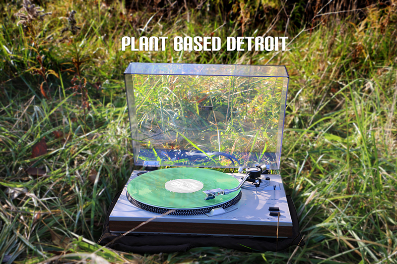

# Plant Based Detroit
A resurgence in analog music experiences has resulted in the creation of new vinyl records and cassette tapes. unfortunately, these objects are still being created with oil-based plastics that further deplete the planet's natural resources and create toxic waste when discarded. Bio-based polymers are natural and biodegradable. They have replaced synthetic plastics in much of the food and retail industries, and it's time for the music industry to catch up. Plant-based Detroit supports the Plantalogue movement as a platform for its sonic experimentation.

_plantalogue_ (n) - a analogue container for data (e.g. music) derived from plant-based materials. Plantalogue replaces synthetic PVC plastic traditionally used to create vinyl and cassette tapes with PLA plastic made from renewable resources like corn starch and sugar cane.

Plant Based Detroit is a collection of sonic content exploring the relationship between people, plants and place while also striving to limit the negative impact their physical sonic assets have on the planet. It is a musical soundscape experience generated by a vinyl record made from plant-based material. A sound-responsive phone application allows users to enhance the audio experience with a stream of visuals correlating in real-time with the audio. This layered journey celebrates George Washington Carver's impact on materials-science and engineering and the time he spent in Detroit developing plant-based products for Ford Motor Co.

Through both content and application (theory and practice), Plant Based Detroit explores the role of sound and music in fortifying the relationship between people, plants and place. This experience supports the Plantalogue movement to elevate the restorative power of music through media that doesn't destroy the planet.

# Ritual of Plantalogue

1. Purify your hands by placing both palms flatly onto the blank sheet of paper.

2. Open the trace paper.

3. Take the Plantalogue out of it’s sleeve.

4. Place Plantalogue on the record player.

5. Open Plantalogue app on your device.

6. Let your device catch the vibes.

7. Enjoy your journey!

# Team

Plant Based Detroit was developed at the Tribeca Co/Lab Detroit Hackathon, November 2016.

Team members: [Ash Arder](http://asharder.com/about/), [Ivaylo Getov](http://ivaylogetov.com), [Mina Rafiee](http://www.minarafiee.com/), [David Schümudde]()
